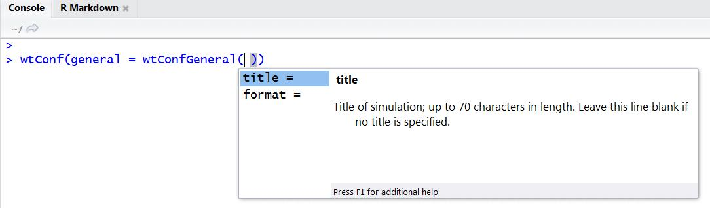

#Introduction {#intro}

##Background

Within the OPTIWELLS-2 project, sponsored by Veolia Water, a detailed study was 
performed for screening available models that: 

- are able to simulate time-dependent well drawdown 

- also include the additional drawdown in case of well interference and 

- are quite easy to parameterise 

The semi-analytical groundwater model WTAQ-2 was chosen, because it fitted best with the 
above defined requirements. However, as the model is programmed in FORTRAN it requires 
that the user follows the steps that are listed below: 

- 1. Step: Definition and parameterisation of text input file,

- 2. Step: Execution of the WTAQ-2 model engine in MS DOS command shell  

- 3. Step: Saving of model results in a text output file  

- 4. Step: Reading and analysing of model outputs  

- 5. Step (in case of well interference): looping through Steps 1-4 for each 
active production well and superposition of additional drawdowns due to well interference  

For simplifying this process it was decided to build an R package that enables to 
perform all these steps and also includes the WTAQ-2 model engine (for more details 
see: [Sonnenberg et al., 2014](https://doi.org/10.13140/RG.2.1.2140.3683)). 
This R package *kwb.wtaq* was developed by Hauke Sonnenberg at Kompetenzzentrum 
Wasser Berlin (KWB). It provides an Application Programming Interface (API) to the analytical 
groundwater drawdown model WTAQ-2, developed by the 
United States Geological Survey (USGS) and provided for free (for further 
information on WTAQ-2 see: <http://water.usgs.gov/ogw/wtaq/>). 
In the following we will simply use "WTAQ" when referring to the software 
WTAQ-2.
  
  
##Objective  

The objective of this tutorial is to demonstrate how the functions from the
R-package *kwb.wtaq* can be used to configure and run a WTAQ model setup and to 
read the resulting groundwater drawdowns from the output files that are generated by 
the WTAQ model software.  
  
  
##Preparation  

In order to use the R package you need to have the **R programming environment
(in version 3.0 or higher)** installed on your computer. You can download it 
for free from <http://cran.rstudio.com/>.

As Integrated Programming Interface (IDE) for the R environment we recommend 
--- and for the purpose of this tutorial require --- to use the free software **RStudio**. 
You can download RStudio from: <http://www.rstudio.com/products/rstudio/download/>.

The programming environment R is shipped with a basic set of functions. It can be extended
by so-called packages that contain user-defined functions. We used this packaging 
mechanism and provide the access functions to WTAQ in the form of an R package 
that we named *kwb.wtaq*. 

Before you can start using the functions provided in the package you need to

1. Install the package into your R programming environment and

2. Load the package into your current R session.

###Installation of required R packages  
  
Since the package *kwb.wtaq* depends on a number of other packages, not only
*kwb.wtaq* but also all the packages that it depends on need to be installed.

In order to simplify the package installation run the following code: 
```{r eval=FALSE}
if(!require("devtools")) { install.packages("devtools") }
devtools::install_github(repo = "KWB-R/kwb.wtaq", dependencies = TRUE)
```

This will download and install the package **[kwb.wtaq](https://github.com/KWB-R/kwb.wtaq)** with all required 
dependencies, i.e.:
  
  - publicly available packages from the Comprehensive R Archive Network (CRAN) and 
  
  - the KWB Github package [kwb.utils](https://github.com/KWB-R/kwb.utils)

If the installation succeeds the messages generated should read like these:
```{r}
## package 'zoo' successfully unpacked and MD5 sums checked
## package 'hydroGOF' successfully unpacked and MD5 sums checked
## package 'lattice' successfully unpacked and MD5 sums checked
## package 'plotrix' successfully unpacked and MD5 sums checked
## 
## The downloaded binary packages are in
##  C:\Dokumente und Einstellungen\Key Hauke\Lokale Einstellungen\Temp\RtmpctBYMz\downloaded_packages
## package 'kwb.utils' successfully unpacked and MD5 sums checked
```

The installation needs to be done only once. The packages keep installed 
until you decide to uninstall them. Uninstalling a package in RStudio can 
be done by clicking on the `Remove package` button right to the
package name on the "Packages" tab. 

###Loading the package  
  
Once you have installed all the requied packages you are almost ready to use
the functions contained in the package *kwb.wtaq*.

As a last step you need to explicitly load the package into your current R 
session by running the following R command:

```{r, warning = FALSE, message = TRUE}
library(kwb.wtaq)


```

You will see messages stating the progress of loading not only the package
*kwb.wtaq* but also of all the packages that it depends on. 

You may see warnings that the packages have been built under R in a higher 
version compared to the version that you are using: 

```{r}
## Warning: package 'kwb.utils' was built under R version 3.0.3
```

Unless you are using R in a version prior to 3.0 these messages do not indicate 
a problem and can be ignored.

Please note that the functions provided in the *kwb.wtaq* package can only be 
used when the package is loaded with `library(kwb.wtaq)` as shown here. 
This needs to be done each time you start a new R session or each time you 
open RStudio. 
If you write an R script that uses the functions from *kwb.wtaq* then 
it would be a good practice to put `library(kwb.wtaq)` as one of the first
lines of your script.

##Using the package help  
  
A detailed description of the WTAQ model parameters is available in the [WTAQ documentation](http://pubs.usgs.gov/tm/tm3b9/pdf/tm3-b9_barlow_wtaqv2_report.pdf). However, within 'RStudio' is not always necessary to consult this manual, because the parameter description is  integrated in the **kwb.wtaq** package help. These information can be accessed by pressing `Ctrl` and `Space` simultaneously, if the cursor is located within a function, e.g. `wtConfGeneral()`: 




The help file for each R function in `RStudio` can be accessed by using the R command `help(functionname)` or using `?` before the functionname, e.g.: 

```{r, eval = FALSE}
?kwb.wtaq::wtConfigure
help(kwb.wtaq::wtConfigure)
```


```{block,  type='rmdtip'}
*Typing `kwb.wtaq::` before the function name is only needed if you haven't loaded 
the package into your R session with `library(kwb.wtaq)` (see [Loading the package](#loading-the-package))*
```

In addition, we also provide a [full description](kwbwtaq_ParameterTable.html) 
of all the parameters that are accepted by the configuration functions, which 
are descriped later in this tutorial. 
